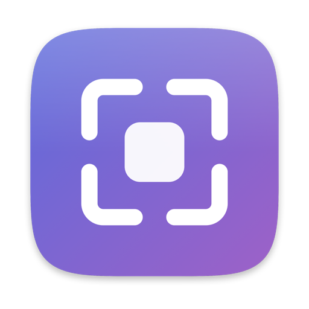

<div align="center">



# Snaplet

**Capture instantly. Explain clearly. Share beautifully.**

An open-source macOS capture tool that lives in the menu bar.<br>
Screenshot, record, annotate, hide what shouldn't be shared, and ship it — in one app, on your Mac.

[](LICENSE)
[](#requirements)
[](#build-from-source)
[](#privacy)
[](https://github.com/berkcangumusisik/mac-screen-recorder/actions/workflows/ci.yml)

[Türkçe README](README.tr.md)

</div>

---

## Why Snaplet

Most capture tools make you choose: a fast screenshot key, or a real editor, or a
recorder, or something that makes the result presentable. Snaplet is all four,
and it never sends your screen anywhere.

- **Everything stays on your Mac.** No account, no subscription, no ads, no
  watermark, no telemetry. Snaplet contains no networking code at all.
- **One app, end to end.** Press a key, mark it up, redact the token you forgot
  about, drop it on a gradient, export. No round trip through three apps.
- **Honest about limits.** Redaction is opaque; blur is called a visual effect,
  not a guarantee. Nothing in this README claims a feature that isn't built.
- **MIT licensed**, no third-party dependencies — only Apple frameworks.

> [!NOTE]
> **The name is provisional.** "Snaplet" has not been checked for trademark or
> App Store conflicts. Rename the product and the bundle identifier before
> publishing anything under it.

---

## Quick start

```bash
git clone https://github.com/berkcangumusisik/mac-screen-recorder.git
cd mac-screen-recorder
open Snaplet.xcodeproj      # select the Snaplet scheme and Run
```

Snaplet appears in the menu bar — no dock icon, no window. Press **⌃⌥⌘A** and
drag to capture; the image is on your clipboard before you let go of the key.

---

## Features

| | |
|---|---|
| **Instant capture** | Area, window, full screen, repeat-last-area — each on its own configurable global shortcut, with an optional self-timer |
| **Pin to screen** | Keep a capture floating above every window while you work from it |
| **Colour picker** | Read the hex value under the pointer straight from the selection loupe |
| **Screenshot editor** | Non-destructive: arrows, shapes, freehand, text, callouts, numbered steps, magnifier, blur, pixelate, opaque redaction |
| **Share-ready styling** | Backgrounds, padding, shadows, a neutral window frame, captions, social aspect ratios, savable presets |
| **Screen recording** | MP4 with system audio, microphone, cursor, click highlighting, pause and resume, and a composited webcam overlay |
| **Light video editing** | Open any recording, trim, add zoom emphases and time-ranged text or redaction, export MP4 or GIF |
| **On-device text recognition** | Copy text off the screen, search your history by it, get suggestions for regions that look sensitive |
| **Local history** | Thumbnails, favourites, filters, search over file names and recognised text |
| **Bug report flow** | A local Markdown report with the media beside it, and nothing added that you didn't tick |

<details>
<summary><strong>Instant capture — details</strong></summary>

- Menu-bar app with no dock icon and no window until you need one.
- Configurable global shortcuts for area, window, full-screen, repeat-last-area,
  start/stop recording, copy-text-on-screen and edit-clipboard-image.
- Selection overlay with crosshair, dimming, live pixel dimensions and a pixel
  loupe. ⇧ constrains to a square, ⌥ draws from the centre, Space moves the
  selection, Esc cancels.
- The overlay draws a snapshot taken *before* it appeared, so Snaplet's own
  overlay, preview panel and recording control can never appear in a capture —
  and confirming a selection needs no second capture.
- A selection can cross displays. The result is stitched from each one and
  rendered at the sharpest scale involved, so dragging from a Retina screen onto
  a 1× monitor does not throw away detail. Anything no display covers stays
  transparent rather than being filled in.
- Repeating the last area re-checks that the display is still connected and that
  the rectangle is still inside it.
- An optional delay (3, 5 or 10 seconds) runs *after* you choose what to
  capture, so you can open a menu or hover something first.
- Press <kbd>C</kbd> while selecting to copy the hex colour under the pointer.
  The loupe shows it live, so you can see what you are about to copy.
- Captures go to the clipboard immediately. Writing a file is optional.
- A small preview panel appears without stealing focus: edit, save, pin, reveal
  in Finder, or drag the file straight into another app.
- **Pin to screen** keeps a capture floating above every window — useful for
  comparing two states or keeping a reference next to what you are rebuilding.
  Pinned shots are excluded from later captures, and the menu bar can close them
  all at once.

</details>

<details>
<summary><strong>Screenshot editor — details</strong></summary>

Non-destructive: the source image is never modified. Crop, rotation and every
annotation are stored separately and applied when you export.

- Crop and rotate.
- Arrow, line, rectangle, ellipse, freehand, highlighter.
- Text, callout bubbles, auto-numbered step markers, magnifier.
- Blur, pixelate and opaque redaction.
- Colour, thickness and font size; select, move, resize, nudge and delete;
  undo/redo.
- Captions are typed on the canvas where they will appear: double-click one, or
  press Return with it selected.
- Zoom with ⌘+ / ⌘− / ⌘0 (fit) / ⌘1 (actual size), the trackpad pinch, or ⌥ and
  the scroll wheel. A plain scroll pans, which is what a large screenshot needs.
- Export to PNG or JPEG with a quality setting.

Redaction draws an opaque block and is the recommended way to hide something.
Blur and pixelate are presented as visual effects, not as a security guarantee.
Export always rasterises: the exported file contains one flat image, and the
original pixels under a redaction are not written into it. Tests read the
exported pixels back to prove it.

</details>

<details>
<summary><strong>Share-ready styling — details</strong></summary>

- Solid, gradient or image backgrounds, or none at all.
- Padding, corner radius and shadow.
- A neutral window frame of Snaplet's own design.
- Title and short description.
- Original, 1:1, 16:9, 9:16 and 4:3 output; live preview and pixel dimensions.
- Five starting presets — Clean, Midnight, Studio, Docs, Social — plus your own
  saved presets.

</details>

<details>
<summary><strong>Screen recording — details</strong></summary>

- Record the full screen, a window or a selected area.
- System audio and microphone toggle independently. With both on they are mixed
  into a single track on a shared clock, rather than written as two tracks a
  player might ignore.
- Pointer visibility, click highlighting, 30 or 60 FPS, original resolution or a
  1080p/1440p/4K limit (never upscaled), optional countdown.
- MP4 (H.264) output written straight to disk as it is captured.
- Menu-bar timer, a movable floating control, and stopping from the shortcut.
- Pause and resume, from the floating control or the menu bar. The pause is cut
  out of the timeline rather than frozen, so a two-minute session with a
  one-minute pause produces a one-minute file with no dead air.
- Optional round or rounded-rectangle webcam overlay, composited into the
  encoded frames rather than only shown on screen.
- Quitting Snaplet while it is recording finalises the file first, so the
  partial recording is kept and plays. Snaplet only reports success after the
  file is finalised.

</details>

<details>
<summary><strong>Light video editing — details</strong></summary>

- Open a recording from the menu bar (<kbd>⌘O</kbd>), from the history, from
  the preview panel, or by dropping a file on Snaplet's Dock icon.
- Trim start and end, scrub the preview, save any frame as an image.
- Presentation styling and aspect ratio for the output.
- Zoom emphases over a time range with an eased ramp.
- Text and opaque redaction boxes over a time range.
- MP4 export, and GIF export for a short selection with duration, frame-rate and
  width limits.
- Progress and immediate cancellation.

Preview and export run through the same composition, so what you see playing is
what gets written.

</details>

<details>
<summary><strong>Text recognition, history and bug reports — details</strong></summary>

**Text recognition** uses Apple's Vision framework on this Mac, off the main
thread. No cloud AI, no API key, no remote OCR service.

- Copy the text in a selected area straight to the clipboard with a shortcut.
- Read a screenshot's text in the editor and copy selected lines.
- Search your history by recognised text.
- Suggestions for possibly sensitive regions — email addresses, key-shaped
  strings, tokens, IP addresses, long numbers — which you approve before
  anything is hidden. They are pattern matches over text Vision could read:
  they will miss things and they will flag harmless ones.

**History** stores metadata only — path, size, recognised text and a small
thumbnail file. Media stays in your output folder and is never copied into the
database. Reopen an item, reveal it in Finder, remove it from the history, or
move the file to the Trash; the difference between the last two is stated in
the interface. Snaplet never deletes your capture files on its own.

**Bug reports** are written locally: a form for title, steps, expected and
actual, with numbered markers from the editor able to seed the steps list.
Environment lines are opt-in and shown in full before you share them — your
computer name, account name and file paths are never added. Output is Markdown
on the clipboard, or an export folder with the media beside it. Snaplet does not
connect to GitHub, and the report says plainly that the media must be attached
by you.

</details>

---

## Requirements

| | |
|---|---|
| macOS | 15 or later |
| Xcode | 26 or later (to build from source) |
| Architecture | Apple silicon is the development and test target. The project builds for Intel, but Snaplet has not been tested there, so no claim is made about it. |
| Dependencies | None. Apple frameworks only. |

## Build from source

```bash
xcodebuild -project Snaplet.xcodeproj -scheme Snaplet -configuration Debug -destination 'platform=macOS' build
```

```bash
./scripts/run-tests.sh        # full test suite
./scripts/build-release.sh    # Release .app + zip into dist/
```

The default build signs ad hoc, which is enough to run Snaplet on the Mac that
built it. Distributing to other machines needs signing and notarisation — see
[docs/signing-and-notarization.md](docs/signing-and-notarization.md).

> [!IMPORTANT]
> An ad hoc signature is derived from the binary, so it changes on every build,
> and macOS ties Screen & System Audio Recording to the signature. Expect to
> grant that permission again after each rebuild. Signing with a stable
> self-signed certificate avoids this while developing — see
> [Keeping permissions across rebuilds](docs/signing-and-notarization.md#1b-keeping-permissions-across-rebuilds).

<details>
<summary><strong>Regenerating the app icon</strong></summary>

The icon is generated from source rather than checked in as finished artwork, so
it can be reviewed and adjusted like any other file:

```bash
swift scripts/make-app-icon.swift
```

It writes every size into `Snaplet/Resources/Assets.xcassets/AppIcon.appiconset`
plus a 1024 px preview at `build/icon-preview.png`. The 16 and 32 pixel sizes are
drawn with their own bolder geometry, because downsampling the full artwork turns
it into a smudge at those sizes. The menu-bar item deliberately keeps an SF
Symbol so it follows the system's template-image behaviour in light and dark.

</details>

## Permissions

Snaplet asks for a permission only when you first use the feature that needs it.

| Permission | Needed for | When it is asked |
| --- | --- | --- |
| Screen & System Audio Recording | Every screenshot and recording | The first capture |
| Microphone | Narration in a recording | The first recording with "Record microphone" on |
| Camera | The webcam overlay | The first recording with the overlay on |

Nothing else is requested. Snaplet does **not** need Accessibility permission:
its global shortcuts use Carbon hot keys, which the system delivers only for the
exact combinations Snaplet registered. Snaplet never observes general keyboard
input. Click highlighting is drawn by the system's capture pipeline and needs no
extra permission.

If you deny a permission, Snaplet says what is missing and offers to open the
right System Settings pane. Granting it later works without restarting: Snaplet
confirms with ScreenCaptureKit rather than trusting the value macOS caches for
the process.

## Keyboard shortcuts

Defaults use ⌃⌥⌘ so they do not collide with the built-in macOS screenshot
shortcuts (⇧⌘3/4/5/6). All of them can be changed in Settings › Shortcuts, and
any that the system refuses is reported there.

| Action | Default |
| --- | --- |
| Capture area | <kbd>⌃⌥⌘A</kbd> |
| Capture window | <kbd>⌃⌥⌘W</kbd> |
| Capture full screen | <kbd>⌃⌥⌘F</kbd> |
| Repeat last area | <kbd>⌃⌥⌘R</kbd> |
| Start / stop recording | <kbd>⌃⌥⌘V</kbd> |
| Copy text on screen | <kbd>⌃⌥⌘T</kbd> |
| Edit clipboard image | <kbd>⌃⌥⌘E</kbd> |

While selecting: <kbd>⇧</kbd> square, <kbd>⌥</kbd> from centre, <kbd>Space</kbd>
to move, <kbd>Esc</kbd> to cancel. In the editor, single keys switch tools
(V, C, A, L, R, O, D, H, T, B, S, M, U, P, X) and <kbd>⌘Z</kbd> / <kbd>⇧⌘Z</kbd>
undo and redo.

---

## Privacy

Every capture, edit, recognition pass and export happens on your Mac:

- Screenshots and recordings are produced by ScreenCaptureKit and written to your
  chosen output folder (default `~/Pictures/Snaplet`).
- Editing is in-memory; exports are written with ImageIO and AVFoundation.
- Text recognition uses Apple's Vision framework locally.
- History metadata is stored in `~/Library/Application Support/Snaplet`, with
  thumbnails as small JPEG files beside it. Media is referenced by path, never
  copied in.
- Preferences live in the app's `UserDefaults`.

Snaplet contains no analytics SDK, no crash reporter and no networking code. Its
only dependencies are Apple frameworks, so there is nothing else to audit.

Logging is deliberately narrow: lifecycle and error information only. Captured
pixels, recognised text, window titles and file paths are never written to the
log.

## Architecture

```
Snaplet/
  App/           Composition root, menu bar, main menu, app delegate
  Core/          Errors, logging, coordinate conversion, image export, temp files, metrics
  Permissions/   Screen, microphone and camera permission state
  Hotkeys/       Shortcut model, Carbon registration, key-code translation
  Capture/       ScreenCaptureKit stills, selection overlay, capture coordinator
  Editor/        Non-destructive document, annotations, renderer, canvas, inspectors
  Presentation/  Style presets and the share-ready renderer
  Recording/     Configuration, state machine, writer, audio mixer, webcam, compositor
  VideoEditor/   Edit model, frame renderer, composition builder, exporter, UI
  OCR/           Vision recognition and sensitive-pattern suggestions
  Library/       SwiftData history store and window
  BugReport/     Report model and form
  Settings/      Preferences, store, settings UI, shortcut recorder
  UI/            Preview panel, error presentation, help window
```

Three ideas hold it together:

1. **One coordinate authority.** `ScreenGeometry` is the only place that converts
   between AppKit points, Core Graphics display points and image pixels. Every
   capture path goes through it, and it is covered by tests including
   negative-origin and secondary-display layouts.
2. **One renderer per medium.** Screenshots have `AnnotationRenderer`; video has
   `VideoFrameRenderer`. The editor preview and the exporter call the same code,
   so a preview cannot drift from what is written.
3. **Explicit lifecycles.** Recording has a real state machine (`RecordingState`)
   whose transitions are validated and tested; exports are cancellable jobs;
   streams, observers and tasks are torn down on the paths that create them.

Handled edge cases: permission denied and later granted, rapid repeated hot-key
presses, starting a recording while one is running, the target window closing, a
display being unplugged, sleep, a full disk, export cancellation, and quitting
with a recording in progress (the partial file is finalised and kept).

**Tests.** 176 unit and integration tests, aimed at the places where mistakes
are expensive: coordinate conversion, rotation transforms, recording-state
transitions, audio mixing, time ranges, file integrity, and censored output —
including a real MP4 written by the test and rendered back to confirm a
redaction covers every frame of its range under zoom and styling.

Capture latency on this machine, in a Release build with two displays: **56 ms**
from the hot key to the selection overlay, **11 ms** from releasing the selection
to the image being on the clipboard. Those numbers, the rest of the
measurements, and how to reproduce them are in
[docs/performance.md](docs/performance.md).

---

## Contributing

Bug reports and pull requests are welcome. Start with
[CONTRIBUTING.md](CONTRIBUTING.md), which covers the layout, the test
conventions and what a change needs before review. Everyone taking part is
expected to follow the [Code of Conduct](CODE_OF_CONDUCT.md).

Security issues: see [SECURITY.md](SECURITY.md).

## Known limitations

- A *recording* area cannot span two displays, because a capture stream is bound
  to one display. Screenshot selections can.
- There is no scrolling capture. Stitching a long page means driving the
  scrollbar with synthetic events, which needs Accessibility permission —
  Snaplet deliberately asks for nothing beyond screen, microphone and camera.
- There is no on-screen measurement ruler; the selection overlay reports live
  pixel dimensions instead.
- There is no automatic cursor smoothing or auto-zoom that follows clicks; zoom
  emphases are placed by hand.
- Video editing is deliberately small: trim, styling, zoom, text and redaction.
  It is not a timeline editor and has no multi-clip support.
- GIF export is capped at 30 seconds, 15 FPS and 800 px wide.
- Sensitive-text suggestions only see what Vision could read, and match on shape.
  Treat them as a prompt to look, not as a guarantee.
- Blur and pixelate are visual effects. Use redaction for anything that matters.
- Snaplet has not been tested on an Intel Mac.
- The Turkish translation ships complete for the current strings; new strings
  need `./scripts/sync-strings.sh` before release.
- No screenshots or demo video are included, because they would have to be
  produced on a machine with screen-recording permission. The scenarios to
  record are written down in [docs/demo-scenarios.md](docs/demo-scenarios.md).

Planned work is in [ROADMAP.md](ROADMAP.md).

## License

MIT — see [LICENSE](LICENSE).
